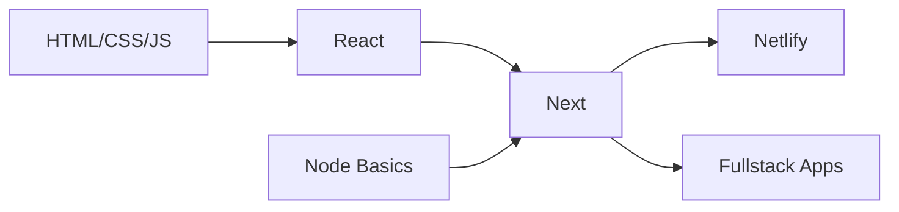

  

  
## 🌟 Let's Connect

 
   
  
  

## 🚀 Featured Projects

<table> 
  <tr> 
    <td width="50%"> 
      <h3 align="center">Project 1</h3> 
      
 
         
        
<em>Tech: Next.js, MongoDB, NextAuth</em>
 
        
✨ Feature 1 | ✨ Feature 2 | ✨ Feature 3
 
      
 
    </td>   
    <td width="50%"> 
      <h3 align="center">Project 2</h3> 
      
 
         
        
<em>Tech: React, Tailwind</em>
 
        
✨ Feature 1 | ✨ Feature 2 | ✨ Feature 3
 
      
 
    </td> 
  </tr>   
  <tr> 
    <td width="50%"> 
      <h3 align="center">Project 3</h3> 
      
 
         
        
<em>Tech: Next.js, MongoDB, NextAuth</em>
 
        
✨ Feature 1 | ✨ Feature 2 | ✨ Feature 3
 
      
 
    </td>   
    <td width="50%"> 
      <h3 align="center">Project 4</h3> 
      
 
         
        
<em>Tech: React, Tailwind</em>
 
        
✨ Feature 1 | ✨ Feature 2 | ✨ Feature 3
 
      
 
    </td> 
  </tr>   
  
</table>

## 🚀 Tech Stack & Tools

  

    <!-- Frontend Card -->
    

      <h3>Frontend</h3>
      

        
        
      

    

    <!-- Styling Card -->
    

      <h3>Styling</h3>
      

        
        
      

    

    <!-- Backend Card -->
    

      <h3>Backend</h3>
      

        
        
      

    

    <!-- Tools Card -->
    

      <h3>Tools</h3>
      

        
        
      

    

  

## 🎨 My Dev Setup

## 📊 GitHub Analytics
<!--

 
   
   

 -->

  

