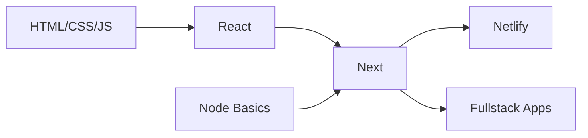

  
## 🌟 Let's Connect

 
   
  
  

  <h1 align="center" style="font-size: 2.5rem; margin-bottom: 40px; color: #2f81f7;">✨ Featured Projects</h1>
  
  
    
    <!-- Project 1 -->
    

      <h3 style="color: #58a6ff; margin-top: 0;">Blog App</h3>
      
      

        Next.js
        MongoDB
        NextAuth
      

      
✨ Create Blogs | ✨ See Blogs Globally

      <a 
        href="https://blog-app-next-mern.netlify.app" 
        style="display: inline-block; background: #238636; color: white; padding: 8px 16px; border-radius: 6px; text-decoration: none; font-weight: 500;"
        onmouseover="this.style.backgroundColor='#2ea043'" 
        onmouseout="this.style.backgroundColor='#238636'"
      >
        View Project
      </a>
    
    
    <!-- Project 2 -->
    

      <h3 style="color: #58a6ff; margin-top: 0;">Project 2</h3>
      
      

        React
        Tailwind
      

      
✨ Feature 1 | ✨ Feature 2 | ✨ Feature 3

      <a 
        href="#" 
        style="display: inline-block; background: #1f6feb; color: white; padding: 8px 16px; border-radius: 6px; text-decoration: none; font-weight: 500;"
        onmouseover="this.style.backgroundColor='#2a7aef'" 
        onmouseout="this.style.backgroundColor='#1f6feb'"
      >
        Coming Soon
      </a>
    
    
    <!-- Project 3 -->
    

      <h3 style="color: #58a6ff; margin-top: 0;">Project 3</h3>
      
      

        Next.js
        MongoDB
        NextAuth
      

      
✨ Feature 1 | ✨ Feature 2 | ✨ Feature 3

      <a 
        href="#" 
        style="display: inline-block; background: #1f6feb; color: white; padding: 8px 16px; border-radius: 6px; text-decoration: none; font-weight: 500;"
        onmouseover="this.style.backgroundColor='#2a7aef'" 
        onmouseout="this.style.backgroundColor='#1f6feb'"
      >
        Coming Soon
      </a>
    
    
    <!-- Project 4 -->
    

      <h3 style="color: #58a6ff; margin-top: 0;">Project 4</h3>
      
      

        React
        Tailwind
      

      
✨ Feature 1 | ✨ Feature 2 | ✨ Feature 3

      <a 
        href="#" 
        style="display: inline-block; background: #1f6feb; color: white; padding: 8px 16px; border-radius: 6px; text-decoration: none; font-weight: 500;"
        onmouseover="this.style.backgroundColor='#2a7aef'" 
        onmouseout="this.style.backgroundColor='#1f6feb'"
      >
        Coming Soon
      </a>
    

  

## 🚀 Tech Stack & Tools

  

    <!-- Frontend Card -->
    

      <h3>Frontend</h3>
      

        
        
      

    

    <!-- Styling Card -->
    

      <h3>Styling</h3>
      

        
        
      

    

    <!-- Backend Card -->
    

      <h3>Backend</h3>
      

        
        
      

    

    <!-- Tools Card -->
    

      <h3>Tools</h3>
      

        
        
      

    

  

## 🎨 My Dev Setup

## 📊 GitHub Analytics
<!--

 
   
   

 -->

  

